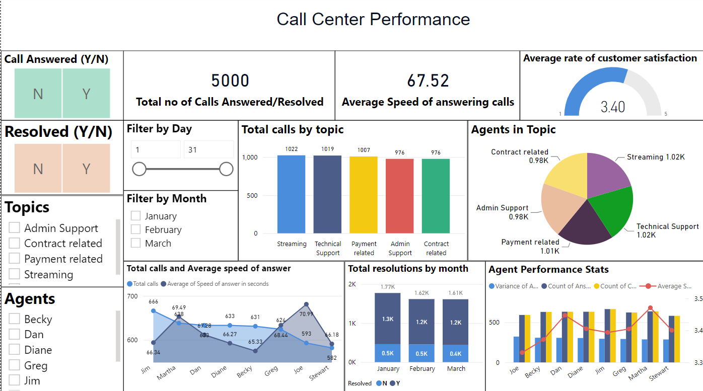

# Call-Center-Management

## Project Description
Building the dashboard for Call Center Management by creating valuable insights which provide a clear report for stakeholders to easily understand call center performance and to answer key questions about the customer satisfaction and most occuring issues.

## Primary Goals
The main goal is to provide valuable insights representing:

1) Number of calls have been answered over time.

2) The average speed of answering the calls.

3) The average rate of customer satisfaction.

## Key Points 
- 1) This project represnts the average speed of answering calls through linear chart comparing with total calls.

- 2) Total number of resolutions per each month.

- 3) Performance of agent.

- 4) Average rate of customer satisfaction.
